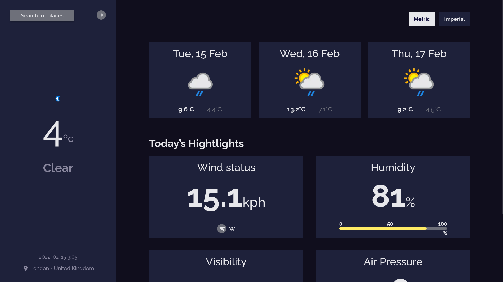

<div align="center">


</div>

<hr/>

> Fast Weather é uma aplicação web com o intuito de fornecer informações sobre o clima de maneira rapida e simples.

## Conteúdos

- [Overview](#overview)
  - [Sobre](#sobre)
  - [Demo](#demo)
  - [Tecnologias](#tecnologias)
- [Como iniciar](#como-iniciar)
  - [Desenvolvimento](#desenvolvimento)
  - [Produção](#produção)
- [Contribuidores](#contribuidores)

## Sobre

Fast Weather exibe informações sobre a temperatura, humidade, pressão do ar e informações sobre o vento. Também é possivel obter uma previsão dos proximos 3 dias com informações da temperatura e clima.

O website exibe as informações com base na localização do usuário ou com relação a um campo de buscas preenchido pelo usuário.

## Demo



[Preview](https://clima-nu.vercel.app/)

## Tecnologias

- React
- Next.js
- TypeScript
- Yarn

## Como iniciar

Para iniciar o projeto é necessario ter o [Node]() que vem com o [NPM]() em sua instalação padrão.

### Desenvolvimento

Para rodar o projeto em ambiente de desenvolvimento basta iniciar os comandos abaixo:

```bash
  yarn dev # http://localhost:3000
```

### Produção

Em ambiente de produção primeiro é necessario buildar o projeto e em seguida rodar o projeto compilado:

```bash
  yarn build # Faz uma build do projeto

  yarn start # Roda a build criada
```

---

## Contribuidores

Pessoas que ajudaram a desenvolver o projeto com alguma contribuição:

<a href="https://github.com/JoaoCarlosAssis/Clima/graphs/contributors">
  
</a>

Criado com [contrib.rocks](https://contrib.rocks).
